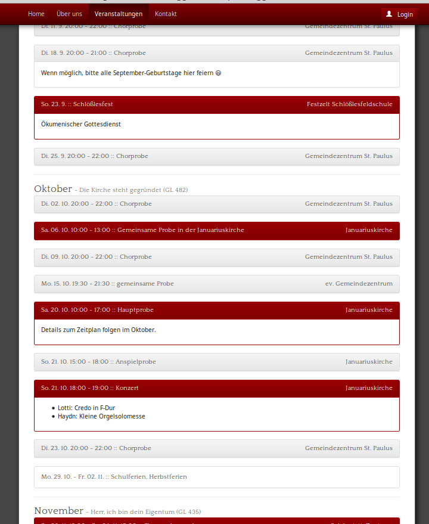

# sk_calendar
This application demonstrates the use of the [icalendar-rrule gem](https://github.com/free-creations/icalendar-rrule).

```ruby {.line-numbers}
#! /usr/bin/ruby
# frozen_string_literal: true

require 'icalendar-rrule'
require 'sk_calendar/config'
require 'sk_calendar/event'

using Icalendar::Scannable

SkCalendar::Config.setup

BEGIN_TIME =   Time.now
CLOSING_TIME = Date.new(2019, 1, 1)

##
# Scans the the icalendar-file with the given name.
#
# @return[Array<Icalendar::Rrule::Occurrence>] a list of all events in the calendar.
def scan_calendar(filename)
  cal_file = File.open(filename)
  calendar = Icalendar::Calendar.parse(cal_file).first

  calendar.scan(BEGIN_TIME, CLOSING_TIME)
end

# scan calendars
scan_holidays = scan_calendar(SkCalendar::Config.holidays_calendar_file)
scan_sk       = scan_calendar(SkCalendar::Config.sk_calendar_file)
scan_month    = scan_calendar(SkCalendar::Config.month_file)

# merge the calendars into one.
full_scan = (scan_sk + scan_holidays + scan_month).sort

# prepare an empty file for output
html_file = File.new(SkCalendar::Config.outfile, 'w')

html_file.puts "<p>Stand #{I18n.l BEGIN_TIME, format: '%d. %B %Y'} </p>"

full_scan.each_with_index do |occurrence, index|
  # put a read-more ruler before the third event
  html_file.puts '<hr id="system-readmore"/>' if index == 3
  # format the event
  sk_event = SkCalendar::Event.new(occurrence)
  html_file.puts sk_event.to_html
end

html_file.close

```

The result will look as follows:

